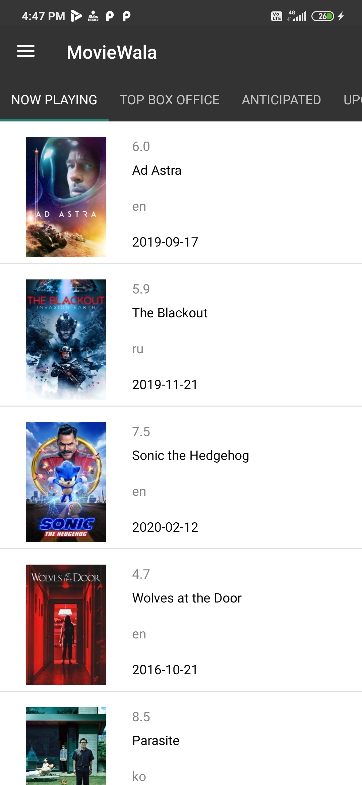
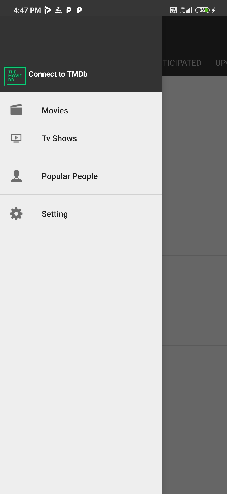
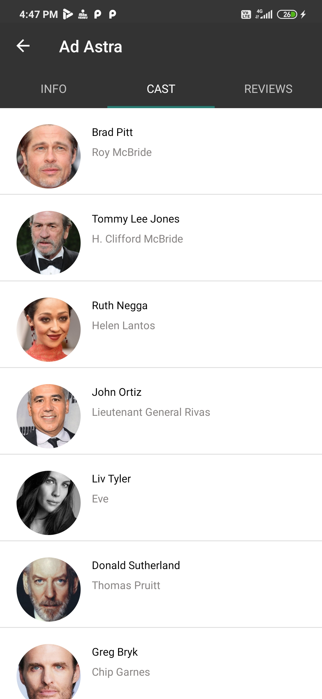
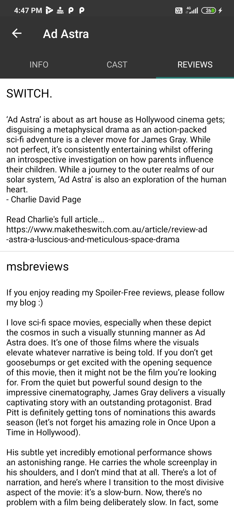
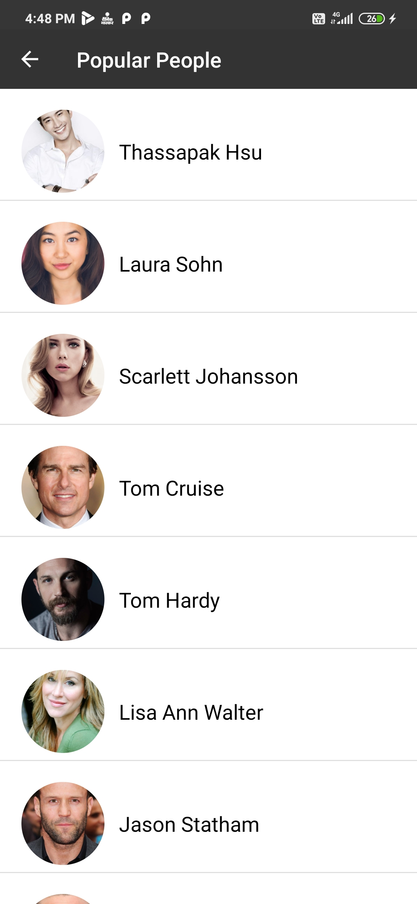

# Moviewala

***You can Install the Sample app by clicking below 👇***

[](https://github.com/DeepakChhipa1999/MovieWala/blob/master/Screenshots/apk/debug/app-debug.apk)


## About

MovieWala is an Android Application which will provide you the Infromation about the Latest Movies, TV Shows and much more. You can check the movie review , starcast, movie revenue, and starcast other movies or tv shows. There is a special thanks to [TMDB](https://www.themoviedb.org/?language=en-USg) for provide us the open source api.

## Screenshots

[](Screenshots/Screenshot1.jpg)
[](Screenshots/Screenshot2.jpg)
[](Screenshots/Screenshot3.jpg)
[](Screenshots/Screenshot4.jpg)
    [](Screenshots/Screenshot5.jpg)
    [](Screenshots/Screenshot6.jpg)


## How to use it?
Clone this repository and import into **Android Studio**
```bash
git clone https://github.com/DeepakChhipa1999/MovieWala.git
```

## Permissions
The App requires the following permissions:
- Internet access.

##Tech Specification
- [OK Http](https://square.github.io/okhttp/)
- [Gson](https://github.com/google/gson)
- [Glide](https://github.com/bumptech/glide)
- [Circular Image View](https://github.com/hdodenhof/CircleImageView)
- [RecyclerView](https://developer.android.com/jetpack/androidx/releases/recyclerview)
- [Material Design](https://material.io/develop/android/components/)


